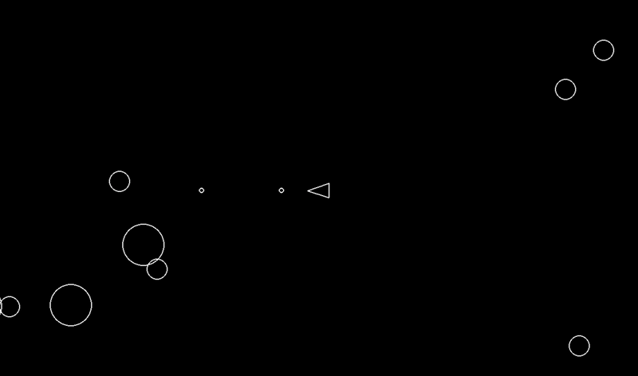

# Pystroids

A simple Asteroids-like game implemented in Python as a hobby mini-project to get familiar with the Pygame library.



## Files

- `main.py`: The main entry point of the game. Initializes Pygame, creates game objects, and runs the main game-loop.
- `asteroid.py`: Defines the `Asteroid` class, which represents an asteroid in the game. Includes logic for splitting into smaller asteroids when shot.
- `asteroidfield.py`: Defines the `AsteroidField` class, which manages the spawning of asteroids.
- `player.py`: Defines the `Player` class, representing the player-controlled ship. Handles movement, rotation, and shooting.
- `shot.py`: Defines the `Shot` class, representing a projectile fired by the player.
- `circleshape.py`: Defines the `CircleShape` class, a base class for game objects with circular collision shapes.
- `constants.py`: Defines various game constants such as screen dimensions, player speed, asteroid parameters, etc.
- `logger.py`: Implements logging functionality for game states and events, writing data to `game_state.jsonl` and `game_events.jsonl`.
- `game_state.jsonl`: A JSONL file containing logs of the game state at regular intervals.
- `game_events.jsonl`: A JSONL file containing logs of specific game events, such as asteroid shots and player hits.
- `pyproject.toml`: Specifies project metadata and dependencies using the TOML format.

## How to Run

1. Make sure you have Python 3.11 or higher installed.
2. Install the required dependencies using `uv`:

    ```bash
    uv install pygame==2.6.1
    ```

3. Run the game by executing the `main.py` file:

    ```bash
    uv run main.py
    ```

## Game Controls

- `W`: Move forward
- `S`: Move backward
- `A`: Rotate left
- `D`: Rotate right
- `Space`: Shoot

## Logging

The game uses a simple logging system to record game states and events, stored in `game_state.jsonl` and `game_events.jsonl` respectively. The logs can be used for simple debugging or replaying game sessions.
